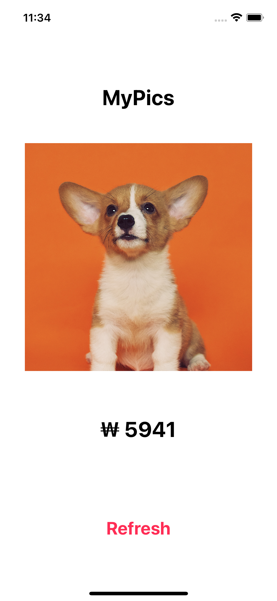
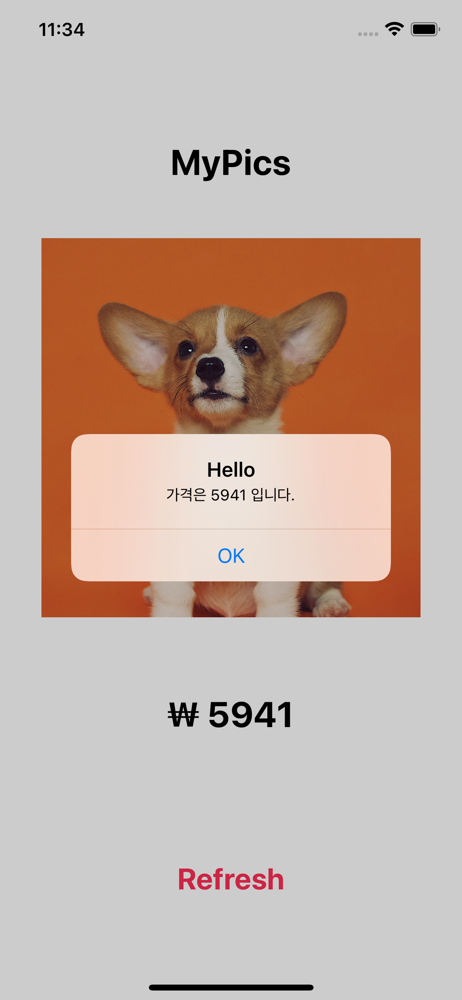
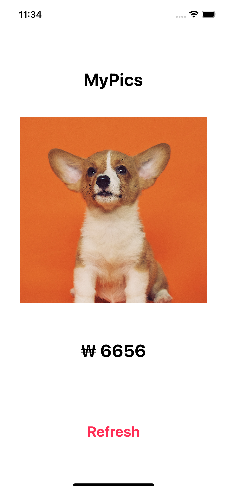
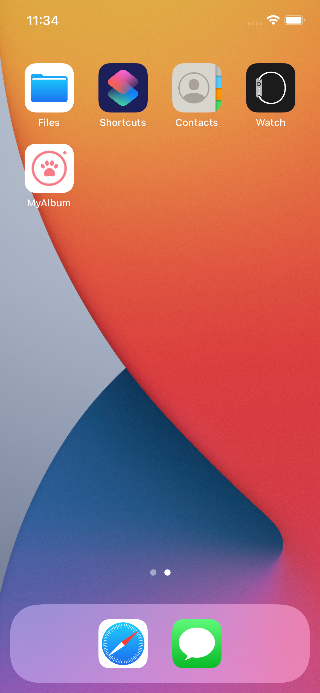

## Chapter 02. 첫 앱 만들기

   

### ViewController
- 스크린 하나를 관리하는 역할 (페이지 하나 혹은 부분)
- StoryBoard는 Design 파트와 Code 파트로 구성

### 
- 다양한 뷰 컴포넌트는 'UIKit'라는 프레임워크 안에 위치
- 뷰의 위치는 스크린 좌측 상단이 (0, 0)으로 기준

### 앱 동작방식의 이해
- 앱은 기본적으로 여러 개의 오브젝트로 구성
- 오브젝트들은 서로 메시지를 보내며 커뮤니케이션
- iOS 앱은 이벤트 발생에 따라 작동 (앱은 이벤트를 계속 기다림)
- 이벤트가 들어오면 해당하는 프로세스가 동작

### Object, Data, Method
- App은 Object로 구성
- Object는 데이터(Data)와 기능(Method)으로 구성

### String and Variable
- 문자열(String)은 문자 하나하나의 나열
- Swift는 'String interpolation' 가능 ("Hello \\(변수)" -> "Hello 지호")
- 변수(Variable)은 어떤 값을 저장할 수 있는 공간
- ViewController를 포함한 Object들은 많은 변수들을 갖고 있음
- 변수는 Type에 따라서 들어가는 Value가 다름
- Object는 변수를 통해 값을 지속적으로 트래킹 가능

### 아웃렛 연결하기 (Connecting Outlet)
- Action을 연결하는 것과 비슷
- 화면의 Label 등을 연동하여 표시 가능하게 함

### Variable vs. Constant
- 변수는 'var', 상수는 'let'으로 정의
- 가능하면 변수를 적게, 상수를 많이 사용하길 권장
- 변경이 필요한 경우 키워드를 var로 바꾸어 사용 권장

### 메소드 작성하기 (Writing Method)
- 기술 문제 방지를 위해 중복되는 코드가 보이면 하나의 메소드로 작성
- 메소드는 'func'를 사용하여 작성
- 메소드나 함수는 최대한 한 가지의 일만 하는 방식으로 작성

### 타입 추론
- Swift는 데이터 타입을 명시적으로 적지 않아도 기본적으로 정의 가능
- 옵션 키를 누르고 변수명 혹은 상수명을 누르면 타입 확인 가능

### Local vs. Instance variable
- 변수는 종류에 따라 사용 가능한 범위가 다름
- 로컬 변수는 메소드에서만 사용되고 끝남
- 인스턴스 변수는 오브젝트 안에서 전반적으로 사용

### Closure 기초
- Closure = { } : 실행 가능한 코드 블럭
- 이것을 변수처럼 함수에도 넘겨줄 수 있음
- 클로져는 매우 어려운 개념

### Styling Image
- 아이폰은 1x, 2x, 3x의 3가지 사이즈(해상도)로 Image를 사용
- 기기에 따라 사용하는 화질(사이즈)가 다름
- Assets.xcassets에 이미지를 드래그하여 넣어줄 수 있음
- 이미지 이름 뒤에 '@2x'를 쓰는 것은 해당 사이즈라는 것을 의미
- 사이즈나 비율이 맞지 않으면 Content Mode를 설정 (Aspect Fill)

### Auto Layout
- Preview를 확인했을 때 정렬 등이 디바이스에 따라 다를 수 있음
- 일관적인 디자인을 위해 'Auto Layout'이 필요
- 위치와 사이즈 정보를 결정
- Add Missing Constraints를 사용하면 임의로 지정 가능
- 현업에서는 디자이너와 정한 규칙으로 하나하나 지정
- Clear Constraints를 먼저 실행
- 컨트롤 누르며 부모 뷰로 드래그해 관계 지정
- 스스로에게 드래그하여 높이, 너비 설정 가능

### App Icon and Display name
- Assets.xcassets에서 AppIcon에 이미지를 넣어 설정 가능
- 요구하는 사이즈를 맞추어 이미지를 넣어줌
- App Icon Generator라는 사이트에서 아이콘 사이즈 변경
- 프로젝트 Display Name을 변경하여 앱 이름 설정 가능
